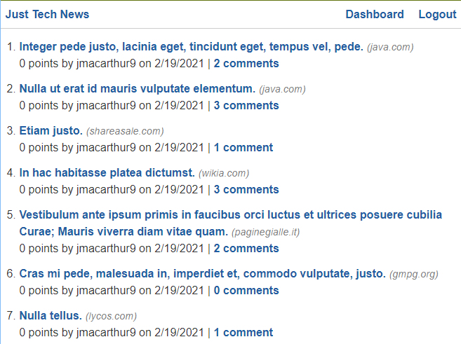

# Just Tech News
A news-based site with a coding theme.

# Installation

Clone the repositry from GitHub and open using Visual Studio Code.

# Usage 
[Deployed Site](https://rst-just-tech-news.herokuapp.com/)

# Credits

Made by [Russ Tracy]

[express.js](https://www.npmjs.com/package/express)

[express-session](https://www.npmjs.com/package/express-session)

[connect-session-sequelize](https://www.npmjs.com/package/connect-session-sequelize)

[MySQL 2](https://www.npmjs.com/package/mysql2)

[handlebars](https://handlebarsjs.com/)

[Sequelize](https://www.npmjs.com/package/sequelize)

[dotenv](https://www.npmjs.com/package/dotenv)

# Questions

[Contact Me](russ_tracy@comcast.net)

[GitHub](https://github.com/russtracy)